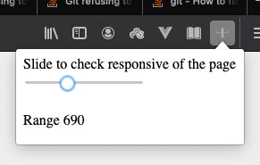

# Responsify-slider-extension [Beta]
Responsify slider is an extension that helps to check the responsive of the website not specif to any width and height. Use the slider to set the width in your view port.

### Thoughts
- Add live change of slider
- Add height slider
- Reset 
- Show most frequent resolution
- Better UI

### TODO
- [x] Learn about Building Basic firefox extention
- [x] Build basic Beta version of concept/ idea
- [ ] Build one by one as mentioned in thoughts
- [ ] work on Light / Dark mode
