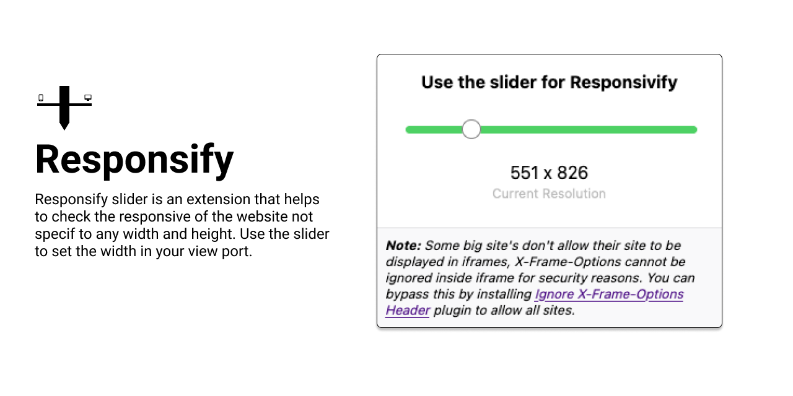

# Responsify-slider-extension [Beta v1]
Responsify slider is an extension that helps to check the responsive of the website not specif to any width and height. Use the slider to set the width in your view port.

### Thoughts
---
- Add live change of slider
- Reset 
- Show most frequent resolution
- Better UI

### TODO
---
- [x] Learn about Building Basic firefox extention
- [x] Build basic Beta version of concept/ idea
- [x] Worked on CSS styles
- [x] Research on loading all websites inside iframe

### Steps to load this extension in Firefox
---
- Type "about:debugging" on address bar
- click "This Firefox" (in newer versions of Firefox), click "Load Temporary Add-on"
- select any file in your extension's directory.

For video reference 
[Video](https://www.youtube.com/watch?v=cer9EUKegG4&feature=emb_title)

### Reference
---
[X-Frame-Options](https://developer.mozilla.org/en-US/docs/Web/HTTP/Headers/X-Frame-Options)
[clickjacking](https://docs.djangoproject.com/en/3.1/ref/clickjacking/)

#### YOU CAN USE THIS PLUGIN BY INSTALLING THIS PLUGIN
---
[Ignore X-Frame-Options Header](https://addons.mozilla.org/en-US/firefox/addon/ignore-x-frame-options-header/)

Allows all sites to be loaded in iframes, despite X-Frame-Options header settings.